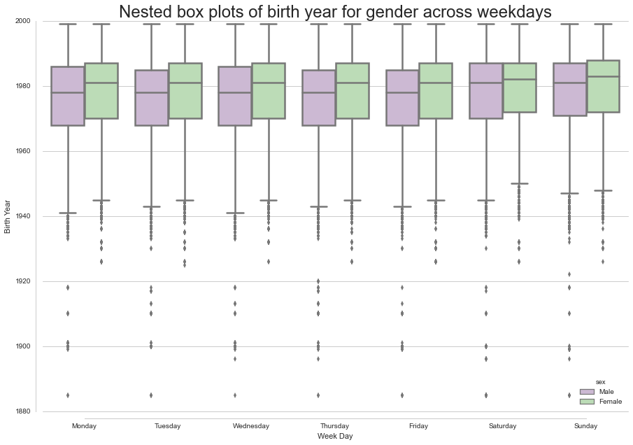

### Python version used for assignment
Python 2.7.10 :: Anaconda 2.3.0 (64-bit)

### Homework 8 - Phase I
The plot created consists nested box plots of birth year variable for gender categories (male and female) over the different days of the week

### Data Used
The data used for this plot is taken from Citibike repository for the month of October 2015
This can be accessed in the below link:
https://www.citibikenyc.com/system-data
