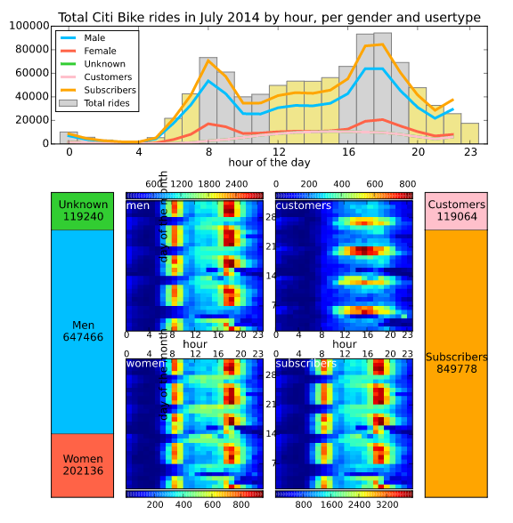

Github Link: https://github.com/cmprince/PUI2015_cprince/blob/master/HW8/cmp-hw8.svg

##Review:

Definitely the initial impression on this plot is like so much information being portrayed and some use of complex plots like heat maps. The bar plot representing total citi rides is easy to read with good use of fonts and plot types. Also, the labeling of axes, title and legend is quite clear and are converying exactly what the plot is trying to achieve. The use of heat map plots is quite commendable as it showing information across so many attributes in easy to read fashion. However, this can be made more easier by better labeling especially the white color used for segment attributes like men, women etc which is getting mixed up into the background in some cases. Even the label day of the month seems to be out of place on heat maps which makes it confusing to understand exactly what is being plotted against what.

On the esthetic lines, the choice of plot and colors is a good one given the complexity of information being captured. However, in the bar plot, there is use of two colors being noticed across bars which is not labeled making it confusing as in whether that would represent any category. Also, the legend implies the mention of different categories of which one of them is missing especially to the bottom of the plot which needs to be better labeled. Honestly, there is too much information being conveyed in this plot which is causing kind of information overload and better thing would be perhaps the use of different figures in order to represent trends across different categories. A better way of doing this would be with the help of fecets or grids that are quite useful especially in the case of high information representation within in the same plot. 
